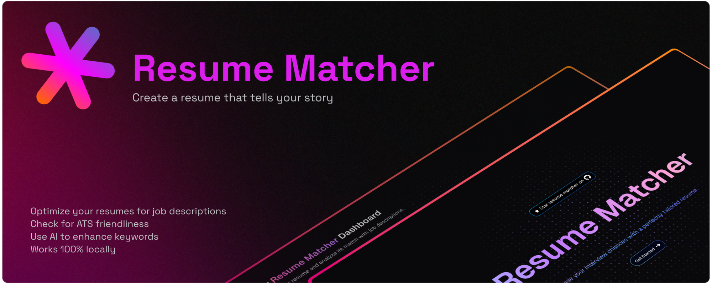

# Resume Matcher

[𝙹𝚘𝚒𝚗 𝙳𝚒𝚜𝚌𝚘𝚛𝚍](https://dsc.gg/resume-matcher) ✦ [𝚆𝚎𝚋𝚜𝚒𝚝𝚎](https://resumematcher.fyi) ✦ [𝙷𝚘𝚠 𝚝𝚘 𝙸𝚗𝚜𝚝𝚊𝚕𝚕 ](#how-to-install) ✦ [𝙲𝚘𝚗𝚝𝚛𝚒𝚋𝚞𝚝𝚘𝚛𝚜](#contributors) ✦ [𝙳𝚘𝚗𝚊𝚝𝚎](#support-the-development-by-donating) ✦ [𝚃𝚠𝚒𝚝𝚝𝚎𝚛/𝚇](https://twitter.com/_srbhr_) ✦ [𝙻𝚒𝚗𝚔𝚎𝚍𝙸𝚗](https://www.linkedin.com/company/resume-matcher/)

**Stop getting auto-rejected by ATS bots.** Resume Matcher is the AI-powered platform that reverse-engineers hiring algorithms to show you exactly how to tailor your resume. Get the keywords, formatting, and insights that actually get you past the first screen and into human hands.

_The organization for the project Resume Matcher._

While the repo sits at [Srbhr's GitHub](https://github.com/srbhr/resume-matcher). We've saved the name for the organization to be used in the future.

